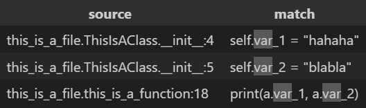

# textpy
Reads a python file/module and statically analyzes it.

## Examples
Create a new file named `this_is_a_file.py`:

```py
class ThisIsAClass:
    def __init__(self):
        """Write something."""
        self.var_1 = "hahaha"
        self.var_2 = "blabla"


def this_is_a_function(a: ThisIsAClass):
    """
    Write something.

    Parameters
    ----------
    a : ThisIsAClass
        An object.

    """
    print(a.var_1, a.var_2)
```

Run the following codes to find all the occurrences of the pattern `"var"` in `this_is_a_file.py`:

```py
from textpy import textpy

res = textpy("this_is_a_file.py").findall("var", styler=False)
print(res)
# Output:
# this_is_a_file.py:4: '        self.var_1 = "hahaha"'
# this_is_a_file.py:5: '        self.var_2 = "blabla"'
# this_is_a_file.py:18: '    print(a.var_1, a.var_2)'
```

Also, when using a Jupyter notebook, you can run a cell like this:

```py
from textpy import textpy

textpy("this_is_a_file.py").findall("var")
```
and the output will be like:



## v0.1.3
* Initial release.
